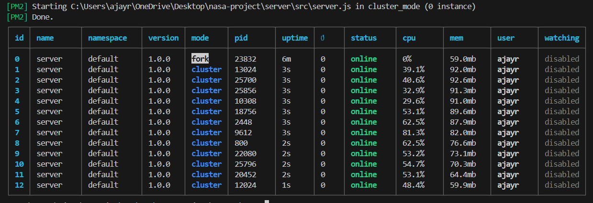

### 📝 PM2: Process Management Made Easy 🚀

PM2 is a production process manager for Node.js applications that has **automatic failover capabilities**, unlike NCM, which requires you to manually create, monitor, and assign work to workers. With PM2, you can deploy your application with ease and get it to run on multiple cores, maximizing its performance.

#### **Getting Started with PM2**
PM2 can be set up in three simple steps:

1.  **Installation**:
    ```bash
    npm install -g pm2
    ```

2.  **Start a single-core instance**:
    -   Navigate to the back-end's source folder where `server.js` is located.
    -   Run the following command:
        ```bash
        pm2 start server.js
        ```
    -   You will now see the back-end running as a single process.

3.  **Run on multiple cores**:
    -   While still in the back-end's source folder, run one of the following commands to get your application to run on all available CPU cores:
        ```bash
        pm2 start server.js -i max
        ```
    -   To ensure the application starts with a fresh process, even if one is already running, use the `-f` flag for "force":
        ```bash
        pm2 start server.js -i max -f
        ```
    -   You will now see your back-end running on multiple cores, one process for each available core.




#### 4. **Managing Live Clusters**:
Once your application is running, you'll need commands to manage the live cluster of processes.

-   **`pm2 list`**: Use this command to see a list of all your running applications and their status, including their ID, name, status (online, stopped, etc.), and CPU/memory usage. This gives you a quick overview of your entire cluster.
-   **`pm2 stop <id|name>`**: This command stops a running process. You can use either the process ID or its name.
-   **`pm2 restart <id|name>`**: This command will stop and then restart a specific process. It's useful for applying code changes without having to start the application from scratch.
-   **`pm2 delete <id|name>`**: This will completely stop and remove the process from the PM2 list.
-   **`pm2 monit`**: This opens a **real-time dashboard** in your terminal, showing live data for all your processes. It's an excellent way to monitor resource usage and check the health of your application.
-   **`pm2 show <id|name>`**: Use this to get a detailed view of a specific process, including its log file paths, environment variables, and restart count. This is a powerful tool for debugging.